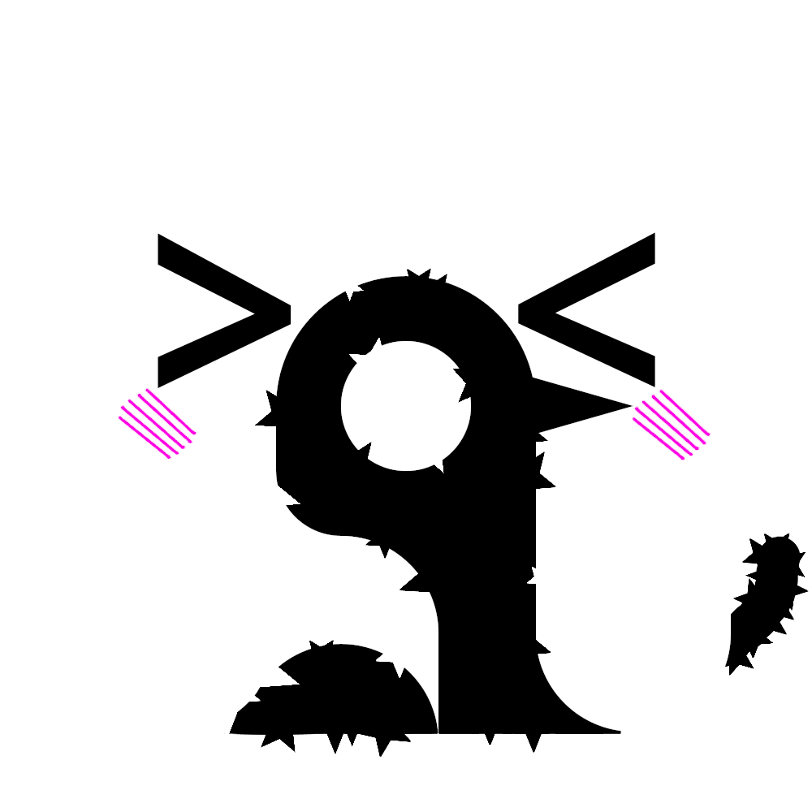

# Nyaa~

Linuwux is a collection of uwu images of distros.

# Contributing
Please read [Contributing.MD](contributing.md)

# Contents
1. [Nyabara](#Nyabara) 
2. [Fedowa](#fedowa)
3. [Gentchu](#gentchu)
4. [Nyarch](#nyarch)
5. [UwUntu](#uwuntu)
6. [Debinyan](#debinyan)
7. [Mwint](#mwint)
8. [OwOid](#owoid)
9. [Swackware](#swackware)
10. [Powopowos](#powopowos)
11. [Ewndeavourowos](#ewndeavourowos)
12. [ArcowoLinux](#arcowolinux)
13. [Bedowock](#bedowock)
14. [FweeBSD](#fweebsd)
15. [NyartixLinux](#nyartixlinux)
16. [Nyanjaro](#nyanjaro)

## Nyabara

Source: I made it myself

## Fedowa

[Source](https://www.reddit.com/r/linuxmasterrace/comments/lxjp3s/saw_nyarch_and_had_to_do_fedowa/)
---

## Gentchu

[Source](https://wiki.gentoo.org/wiki/Project:Artwork/Artwork#Genchu)

License: CC-BY-SA/2.5 
--- 

## Nyarch

[Source](https://www.reddit.com/r/linuxmasterrace/comments/lxfg9j/someone_posted_uwuntu_so_i_made_nyarch/)

License: ["Free"](https://www.reddit.com/r/linuxmasterrace/comments/lxfg9j/comment/gpn4433/?utm_source=share&utm_medium=web2x&context=3)
---

## UwUntu

[Source](https://www.reddit.com/r/linuxmasterrace/comments/lxmp1s/regarding_the_uwuntu_logo_thing_i_was_the/)
---

## Debinyan

Source: https://github.com/CharlotteCross1998/linuwux/pull/6
---

## Mwint

Source: https://github.com/CharlotteCross1998/linuwux/pull/10
---

## OwOid

[Source](https://www.reddit.com/r/linuxmasterrace/comments/lxnjwd/my_boyfriend_decided_to_create_owoid/) (Seems to be dead)
---

## Swackware

[Source](https://www.reddit.com/r/linuxmasterrace/comments/lyt6xi/slawckyware/)

[License](https://www.reddit.com/r/linuxmasterrace/comments/lyt6xi/comment/gpuz8gq/?utm_source=share&utm_medium=web2x&context=3)
---

## Powopowos

[Source](https://www.reddit.com/r/linuxmasterrace/comments/lxz3xu/pop_uwus/)
---

## OwOpensuse

[Source](https://www.reddit.com/r/linuxmasterrace/comments/lyhgxp/my_better_attempt_on_owosuse/)
---

## OwOpenBSD

Source: https://github.com/CharlotteCross1998/linuwux/pull/13
---

## Nwixowos

[Source](https://github.com/TilCreator/NixOwO)

License: CC-BY license
---

## Ewndeavourowos

[Source](https://www.reddit.com/r/linuxmasterrace/comments/ly9zed/endowo_os/)
---

## Arcowolinux

---

## Bedowock

Source: https://github.com/CharlotteCross1998/linuwux/pull/10
---

## FweeBSD 

Source: https://github.com/CharlotteCross1998/linuwux/pull/5
---

## NyartixLinux

[Source](https://svgshare.com/s/Uz_)
---

## Nyanjaro

Source: https://github.com/CharlotteCross1998/linuwux/pull/11
---

## Star History

---
